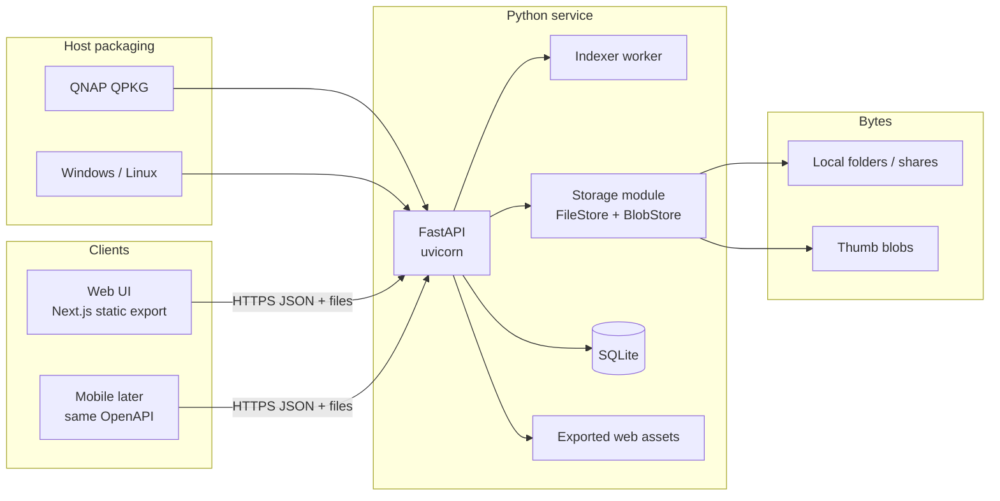
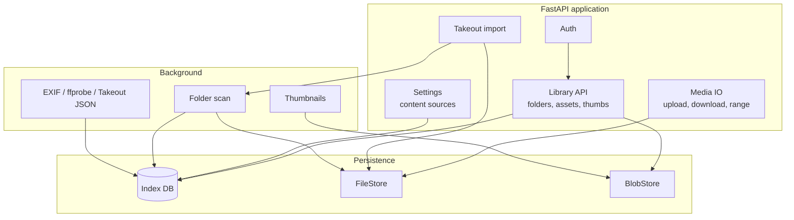

# Architecture

This document describes the technical split: what runs where, how clients talk to the **Python service**, and how hosts (QNAP QPKG, Windows, Linux) are packaged. Product intent is in [system overview](system-overview.md). Delivery order is in [roadmap](roadmap.md). **File and blob I/O:** [storage.md](storage.md).

## Goals

- Run the **same Python service** on **QNAP (QPKG)**, **Windows**, and **Linux**. QPKG is a packaging target, not the only runtime.
- Expose a **versioned HTTP API** (OpenAPI) for web and mobile.
- Ship the web app as **static files** (Next.js export), not a Node server — on every host.
- Keep **original media in a FileStore** (v1: local folders / QNAP shares); the app stores **index and thumbs** (thumbs in a BlobStore), not a second copy of the library.

## High-level architecture



On QNAP, a QPKG script only starts and stops the Python process and registers the web path. On standalone Windows, the MSI can install a WinSW service that launches the same uvicorn process (optional on the first wizard page; on by default). Linux/macOS packaged install is a tarball plus `install.sh` (optional systemd user unit or launchd). Application logic lives in Python. All original and derived I/O goes through the [storage module](storage.md).

## Tech stack

| Layer | Choice | Why |
| --- | --- | --- |
| API | Python, **FastAPI**, uvicorn | User preference; OpenAPI; photo libraries (Pillow, EXIF) |
| Indexer | Same process or a Python worker thread/process | Scan via FileStore, write DB, generate thumbs into BlobStore |
| Storage | **FileStore** + **BlobStore** | Virtual paths and derived blobs; v1 local disk ([storage.md](storage.md)) |
| Web | **Next.js**, App Router, **`output: 'export'`** | TypeScript UI; no Node on any product host |
| QPKG glue | **BusyBox `/bin/sh`**, QDK | QNAP packaging only, not the app language |
| Standalone | uvicorn + data dir + config/env; Windows MSI + service (`publish-msi`); Linux/macOS tarball (`publish-posix`) | Windows, Linux, macOS |
| Mobile | Deferred; any client that speaks the API | Native, Flutter, or PWA later |
| DB | **SQLite** in the **data dir** | One file, no extra daemon; albums/assets via tables + JSON for messy EXIF. **Not MongoDB** (see [Database](#database)) |
| Thumbs | BlobStore keys, URLs via API | Do not depend on Next `next/image` optimizer |

Python on QNAP will be **bundled in the QPKG** or declared as a QPKG dependency. Standalone uses the host’s Python (or a bundled runtime later). We will not assume App Center Node.js.

### What static export means

- **Build machine (Windows/dev):** TypeScript + React compile to HTML/JS/CSS.
- **Browser:** Runs that JavaScript. Dynamic photo lists are `fetch` + React state.
- **Host (QNAP / Windows / Linux):** Serves files and `/api/*`. It does not run `next start`.

Dynamic routes like `/photos/<uuid>` are handled as **client routing** and/or query params, with FastAPI serving `index.html` for unknown UI paths if needed (SPA fallback).

## Logical components



| Component | Responsibility |
| --- | --- |
| Auth | **Identity** (who you are) + **authorization** (what you may see/do). See [Authentication](#authentication) |
| Storage | FileStore (originals) + BlobStore (thumbs). Callers do not use host paths. [storage.md](storage.md) |
| Library API | List timeline, asset detail, folder tree |
| Media IO | Stream originals, accept uploads into a chosen source (via FileStore) |
| Settings | Which sources to index; scan status |
| Indexer | Discover files via FileStore, skip non-media, update DB, enqueue thumbs |
| Takeout import | Phase 2: Google Takeout (zips in place or extract) → same index; **one asset per content hash** (see [takeout.md](takeout.md)) |
| Jobs | Phase 3: persist task runs for audit ([workflow.md](workflow.md)); Takeout import is the first kind |
| Thumb cache | Bounded BlobStore cache; regenerate if missing (Phase 4) |

## HTTP API (contract)

The API is the product boundary. Web and mobile must not read the SQLite file or the host filesystem except through this API (admins using File Station or Explorer are outside the app).

Illustrative v1 surface (names can change; behavior should not):

| Method | Path | Role |
| --- | --- | --- |
| POST | `/api/v1/auth/login` | Check identity with the **auth provider** (QNAP or local); return mosaicWave session |
| POST | `/api/v1/auth/setup` | First standalone admin (`local_credential`) |
| GET | `/api/v1/auth/status` | `platform`, `needs_setup`, current `me` if cookied |
| POST | `/api/v1/auth/logout` | Clear session cookie |
| GET | `/api/v1/me` | Current user, role, private library id |
| GET | `/api/v1/users` | List app users (any signed-in user; for share picker). Create members is still **admin** `PUT` |
| PUT | `/api/v1/users` | Create/update local user or role (**admin**) |
| GET | `/api/v1/settings` | Host **App folder** (`app_dir`) and **Library folder** (`data_dir`) (**admin**). `data_dir_smb` is the durable `smb://` URL when the library is on a NAS. `data_dir_mount` is the macOS share-root dest. `env_override` is true when `MOSAICWAVE_DATA_DIR` is set |
| PUT | `/api/v1/settings` | Move SQLite + libraries + blobs (**admin**). App folder (`app_dir`) keeps `session.key` / `config.json`. Returning to `app_dir` replaces leftover library files. Pointer in bootstrap `config.json` (`data_dir` plus `data_dir_smb` / `data_dir_mount` when on a share — remounted at process start). Optional `mount_point` with `smb://`. `smb://` / UNC: [smb-paths.md](smb-paths.md). NAS save keeps the live mount (`restarting` false). Local-folder save returns `restarting: true` and the API process exits. **409** if env is set, a job is running, or dest already has a library (not when dest is the app folder) |
| GET | `/api/v1/sources` | Own library first (`owned=true`, `perm=write`), then libraries shared with the caller |
| POST | `/api/v1/sources` | **409** — each user already has one library |
| DELETE | `/api/v1/sources/{id}` | **400** — cannot delete your library |
| GET | `/api/v1/sources/{id}/grants` | Owner only. Live `read`/`write` grants |
| PUT | `/api/v1/sources/{id}/grants` | Owner only. Replace live grants. Empty list revokes. Cannot grant to yourself |
| POST | `/api/v1/sources/{id}/scan` | Re-index the **owner’s** library |
| GET | `/api/v1/assets` | Timeline/list (cursor pagination; `album_id` filters membership) |
| GET | `/api/v1/albums` | Virtual albums in sources the caller may read (`rev` included) |
| POST | `/api/v1/albums` | Create a manual album (optional replica `id`; 409 if the name exists) |
| GET | `/api/v1/albums/{id}` | One album |
| PATCH | `/api/v1/albums/{id}` | Rename or set cover. Replica: `base_rev`; **409** if server `rev` differs |
| DELETE | `/api/v1/albums/{id}` | Tombstone album + memberships. Replica: `?base_rev=` |
| POST | `/api/v1/albums/{id}/assets` | Add members (`asset_ids`). Replica: `base_rev` |
| DELETE | `/api/v1/albums/{id}/assets/{asset_id}` | Remove a member. Replica: `?base_rev=` |
| GET | `/api/v1/assets/{id}` | Metadata |
| GET | `/api/v1/assets/{id}/thumb` | JPEG thumb |
| GET | `/api/v1/assets/{id}/preview` | JPEG display (HEIC/TIFF/DNG and other originals the browser cannot paint) |
| GET | `/api/v1/assets/{id}/file` | Original (so the player can skip in time) |
| POST | `/api/v1/thumbs/generate` | Start `thumb_batch` job (one in-process job at a time) |
| POST | `/api/v1/assets` | Upload into the caller's library |
| GET | `/api/v1/fs/list` | Host folder picker. Other users' `{data_dir}/libraries/{id}` dirs are hidden. Optional `warning` when this process cannot list a folder (does not retry as the Mac GUI user). `smb://` and UNC: [smb-paths.md](smb-paths.md) |
| POST | `/api/v1/import/takeout/inspect` | Verify Takeout download/extract (missing zips, oversized files) |
| POST | `/api/v1/import/takeout` | Start deduping Takeout import from a **host path** into the caller's library (`dest` ignored); [takeout-dump.md](takeout-dump.md) |
| POST | `/api/v1/import/takeout/push` | Start a **client upload** session (mobile / this device / cloud Files). Dump is not a server folder |
| PUT | `/api/v1/import/takeout/push/{id}/file` | Upload one dump file (query `relative_path`, raw bytes). Refresh does not cancel |
| POST | `/api/v1/import/takeout/push/{id}/finish` | Run the same Takeout ingest on the uploaded dump, then delete staging |
| POST | `/api/v1/import/takeout/push/{id}/cancel` | Abort a receiving push job |
| GET | `/api/v1/import/takeout/status` | Latest Takeout job for this user (alias; Phase 3: `GET /jobs/{id}`) |
| GET | `/api/v1/jobs` | The caller's task runs; [workflow.md](workflow.md) |
| GET | `/api/v1/jobs/{id}` | One job + progress / result (own jobs only) |
| GET | `/api/v1/jobs/{id}/events` | Job audit log (own jobs only) |
| GET | `/api/v1/sync/changes` | Metadata pull (`since_rev`, tombstones). Push is `/albums` + `base_rev`, not this URL. Covered vs later: [schema.md](schema.md) Sync protocol |
| GET | `/api/v1/health` | Process / load balancer health |

FastAPI generates **OpenAPI** (`/docs`, `/openapi.json`) as the living spec. The web app uses **hand-written** `fetch` + types. Do **not** generate an SDK. Manual API tests use the Postman collection: import [`postman/mosaicwave.postman_collection.json`](../postman/mosaicwave.postman_collection.json) plus a `postman/*.postman_environment.json`. Login stores cookie `mw_session`. A Postman **workspace** is created in the Postman app (not a file). Regenerate the JSON with `python postman/build_collection.py` if routes change.

### Dev vs production routing

| Environment | Web | API |
| --- | --- | --- |
| Local Windows | `next dev` (or preview of export) | uvicorn on another port; Next **rewrites** `/api` → FastAPI |
| QNAP QPKG | FastAPI mounts exported `out/` at `/` (or `/mosaicWave/`) | FastAPI `/api/v1` |
| Standalone | Same: FastAPI serves export + `/api/v1` | Same origin |

CORS is only needed if the web origin and API origin differ (local `next dev`). Packaged hosts share origin.

## Database

Photo **files** stay in a FileStore (v1: local folders / QNAP shares). The database holds **info about** those files: virtual path, dates, EXIF, album membership, scan state. That is a classic index plus relations — not a document store problem.

**Choice: SQLite.** FastAPI talks to it through SQLAlchemy (or similar). One file in the **data directory** next to the blob root. Until the Phase 9 backup/restore/export feature ships, a backup is a copy of that data dir (stop the API or use the SQLite backup API). Do not restore from sync JSON.

### Why not MongoDB

MongoDB can store photo documents and album arrays. It is still the wrong default for mosaicWave.

| | SQLite | MongoDB |
| --- | --- | --- |
| QPKG / standalone | Library inside the Python process | Separate `mongod` (RAM, start/stop, upgrades, x86 vs ARM) |
| Home NAS / PC | Tens/hundreds of thousands of rows is easy | WiredTiger wants RAM; another 24/7 service |
| Albums | `album` + `album_asset` tables (many-to-many) | Arrays of ids; no real foreign keys; easy to orphan |
| Timeline queries | Indexes on `taken_at`, `source_id` | Possible, but you reinvent SQL |
| Messy EXIF | SQLite **JSON** column for leftovers | Natural documents — the only real Mongo win |
| Ops | No extra database server | Community Mongo QPKG, Docker, or a Windows service; fights “Python-only runtime” |
| Local Windows | `library.db` in the app folder | Install Mongo or run Docker just to develop |

There is no supported **embedded Mongo** we would ship in a QPKG or a small standalone install. “Use Mongo” in practice means **a second server**, closer to the Immich/Docker stack we are not building.

Revisit Mongo (or PostgreSQL) only if we drop the single-process product and run a container stack, or we outgrow SQLite with **measured** pain (not hypothetical). Until then, do not add Mongo.

### Schema intent (logical)

**Source of truth for tables and sync:** [schema.md](schema.md) (server DDL implemented Phase 2). Originals I/O: [filestore.md](filestore.md). Job audit: [workflow.md](workflow.md) (Phase 3). Client replica + sync HTTP in Phase 7.

Originals are **not** blobs in the DB (they live in FileStore). Clients keep a **replica** of metadata (and cached thumbs) for offline use. They never open the server SQLite file.

```
user            id, provider, provider_subject, role, ...
source          id, owner_user_id, backend, root_uri, kind, last_scan, error, rev, updated_at, deleted_at
source_grant    id, user_id, source_id, perm, ...   # owner shares read|write
asset           id, source_id, relative_path, size, mtime, mime,
                width, height, taken_at, duration, extra_json, content_hash,
                thumb_rev, rev, updated_at, deleted_at
album           id, source_id, name, cover_asset_id, rev, updated_at, deleted_at
album_asset     id, album_id, asset_id, position, rev, updated_at, deleted_at
job             id, kind, status, user_id, ...
```

- IDs are **UUIDs** so web/mobile can sync.
- Takeout import fills `asset` and albums **without duplicate hashes**; same tables, not a side database.
- `extra_json` holds odd EXIF/sidecar fields until promoted.

## Data

### Originals

- Live in a **FileStore** (v1: user-selected local folders; on QNAP those are shared folders).
- mosaicWave does not move them for indexing.
- Uploads write **into** a configured source so Explorer / SMB / File Station still see new files **when the backend is local disk**.

### Index

Same SQLite file as above. `taken_at` prefers **Takeout sidecar** `photoTakenTime`, then EXIF/video metadata, then file mtime.

### Derived files

Thumbnails (and later optional transcodes) live in the **BlobStore**, keyed by asset id + version. They can be deleted and rebuilt.

### What we do not store in v1

- Face embeddings / people clusters
- A duplicate of every original inside the data directory or SQLite

## Web client

- Next.js App Router, TypeScript, `"use client"` where the UI must fetch.
- Photo grids, infinite scroll, detail view: **client-side** against FastAPI (later: replica when offline).
- Video in the detail view: **Play / Pause**, a time bar, and **−10s / +10s**. People see clocks (`1:23 / 4:56`), not file offsets.
- `next/image`: `unoptimized` or raw `` pointing at the API.
- No Next Route Handlers in production; they would require Node on the host.

## Mobile client

Out of the first QPKG milestones. When started:

- Same `/api/v1` and auth model
- Local **replica** of metadata + cached thumbs for offline ([schema.md](schema.md)); server SQLite remains canonical
- Background upload is an OS problem (especially iOS); the API needs upload + album push (`base_rev`)

## Host packaging

**QNAP** is one install shape. **Standalone** (Windows / Linux / macOS) is the same app with a data directory and config/env.

## QPKG packaging

```
src/qpkg/
  qpkg.cfg
  package_routines
  icons/                  # mosaicWave.png, _80.png, _gray.png (QDK App Center icons)
  shared/mosaicWave.sh    # start / stop / status (BusyBox)
  shared/requirements.txt
src/brand/                # mosaicWave-icon.png (master); scripts/export-icons.py → QPKG / favicon / .ico / .icns
src/server/               # Python package, copied into QPKG by pack script
src/web/                  # Next app; pack script runs next build → shared/web
```

Publish: `scripts/publish-qpkg.ps1` (or `.sh`) → `dist/qpkg/mosaicWave/`. Pack: `scripts/pack-qpkg.ps1` (or `.sh`) runs **QDK `qbuild`** (WSL on Windows). Procedure: [qpkg.md](qpkg.md).

Start script:

1. Set `MOSAICWAVE_PLATFORM=qnap`, data dir `{volume}/.mosaicWave`, bind `0.0.0.0`, port from `Web_Port` (default 8090, configurable), `MOSAICWAVE_WEB_ROOT`.
2. Create a venv and pip-install requirements if needed; launch uvicorn; record PID.
3. Stop: kill PID, wait.

CPU: `pack-qpkg` with no args builds **x86_64** and **arm_64**. 32-bit ARM (`arm-x31`) is a separate `qbuild` arch; QTS **5.0+** is required (`QTS_MINI_VERSION`). A TS-431 on QTS 4.3.6 cannot install this QPKG. Python is a **NAS dependency** (3.10+), not bundled in v1.

## Windows MSI packaging

```
src/msi/
  mosaicWave.wxs          # WiX Package; optional WinSW service
  WixUI_mosaicWave.wxs    # Wizard: folder → Web/API port + Windows service
  shared/mosaicWave.xml   # WinSW 2 config
  shared/mosaicWave.ico   # ARP / shortcut icon (from src/brand)
  shared/ensure-venv.cmd
  shared/mosaicWave-run.cmd
```

Publish: `scripts/publish-msi.ps1` → `dist/msi/mosaicWave/`. Pack: `scripts/pack-msi.ps1` (WiX) → `dist/msi/mosaicWave_0.1.1_x64.msi`. Bind `127.0.0.1` and installer **PORT** (default 8090, Web / API page). **INSTALLSERVICE** (default 1) installs the WinSW service; 0 is files only. Start Menu + desktop shortcuts follow that port. `MOSAICWAVE_PROFILE=prod` (library `%PROGRAMDATA%\mosaicWave`). Do **not** set `MOSAICWAVE_DATA_DIR` so Settings can still move it; uninstall leaves ProgramData. Local debug is `%PROGRAMDATA%\mosaicWave-dev`. Python 3.10+ is a host dependency. Procedure: [qpkg.md](qpkg.md).

## Linux / macOS packaging

```
src/posix/
  mosaicWave.sh                 # run | start | stop | restart | status | deps | port
  install.sh                    # Linux: ~/.local/lib/mosaicWave; macOS: /Applications/mosaicWave.app (sudo)
  uninstall.sh                  # does not delete the library
  mosaicWave.service            # systemd user unit (@PREFIX@)
  com.mosaicwave.app.plist      # launchd LaunchDaemon (@PREFIX@, @DATA@, @PROFILE@)
  macos-Info.plist / macos-open.sh / macos-open.c  # Finder bundle; native launcher on install
  mosaicWave.icns / mosaicWave-icon.png  # Finder app icon (iconutil on install)
```

Publish: `scripts/publish-posix.ps1` (or `.sh`) → `dist/posix/mosaicWave/`. Pack: `scripts/pack-posix.ps1` (or `.sh`) → `dist/posix/mosaicWave_0.1.1_posix.tar.gz`. On the target: `sh install.sh` (macOS: `sudo sh install.sh`; LaunchDaemon — do not run `mosaicWave.sh start` as a normal user). Bind `127.0.0.1:8090`. Do **not** set `MOSAICWAVE_DATA_DIR` so Settings can still move it. Data: Linux `~/.local/share/mosaicWave` (debug `mosaicWave-dev`); macOS packaged `/Library/Application Support/mosaicWave` (`MOSAICWAVE_PROFILE=prod`); local Mac debug `/Library/Application Support/mosaicWave-dev`. Python 3.10+ is a host dependency. Procedure: [qpkg.md](qpkg.md).

## Authentication

**Decision:** Auth is a **provider**. FastAPI always issues its **own** `/api/v1` session after the provider accepts the user. The public contract is **`/api/v1/auth/*`**.

| Profile | Identity |
| --- | --- |
| **`qnap`** (QPKG on QTS) | **QNAP accounts only.** No mosaicWave password table on this profile. A `user` row still exists (id, role, grants) keyed by QNAP username. First QNAP login creates that row (admin if first). |
| **`standalone`** (Windows / Linux / macOS product) | **Local auth provider** (hashed passwords in a credential table, not synced to clients). Required because there is no QTS. Gated off when `platform=qnap`. |

| Client | How identity is established |
| --- | --- |
| Web opened from **QTS desktop** (`qnap`) | User is already logged into QTS. FastAPI **validates that QTS session** (SID / NAS cookie). No second password prompt if the session is valid. |
| **Mobile** or browser **not** inside QTS (`qnap`) | Client sends username/password (or later SSO) to `POST /api/v1/auth/login`. The **server** checks them with QNAP. Client then uses the mosaicWave token/cookie. |
| Standalone web / mobile | Same `POST /api/v1/auth/login` against the **local** provider. First-run: `POST /api/v1/auth/setup`. |

**Do not:** copy `/etc/shadow`, skip QNAP auth on a QPKG install, or teach clients to call undocumented CGI as the public API.

## Authorization

**Decision:** Each user has **one private library** (`source.owner_user_id`). Login is not enough to see another user's photos. The **owner** may share that library with another user via `source_grant` (`read` or `write`). **Admin has no bypass** — they see another library only if it was shared with them. “Every logged-in user sees every source” is **rejected**. Admin may create **local** members on standalone only (not on QNAP).

The QPKG/uvicorn process is a **service account**. It cannot use the caller’s OS file ACL by default. Per-user access is therefore **in SQLite**, not `chmod`.

| Role | Who | May |
| --- | --- | --- |
| **admin** | First-run user; QNAP administrators group can map to admin on `qnap` | Own library (read/write, Takeout, scan, upload, jobs). Create/update **members** on standalone. Other libraries only with a grant |
| **member** | Everyone else with a `user` row | Own library (same photo rights as admin). Other libraries only with a grant |

`source_grant`: unique `(user_id, source_id)`. Owner `PUT` replaces the live list; removed rows are tombstoned. `read` = list/thumb/file/albums/sync. `write` = that plus upload and album edits. Takeout import, scan, and Settings data-dir stay on the **owner**. `POST /sources` returns **409**. `DELETE` of a library returns **400**.

Rules:

1. Unauthenticated → 401 on all library routes (health stays open).
2. Asset ids outside the caller's readable sources → **404** (do not leak that the asset exists).
3. List, thumb, file, and sync **filter** to owned + granted sources. No admin bypass.
4. Takeout import writes into `{data_dir}/libraries/{user_id}`. `dest` on the import body is ignored.
5. Jobs are filtered by `job.user_id`.
6. First standalone user (or first QNAP admin to open the app) is **admin** and still has only their own library until they share or receive a grant.

Phases 1–4 used an unauthenticated stub so import/scan/jobs could land. **Phase 5** enforced login. Grants were the Phase 5 access model, then private-library-only; **share** turns `source_grant` back on, owned by the library owner (not a global admin grant).

## Security (baseline)

- API is not public to the internet by default; reverse proxy (QNAP myQNAPcloud, Caddy/nginx on standalone) is the user’s choice later.
- Authenticate all library routes except health. **Authorize** by library ownership plus `source_grant` (no admin bypass).
- FileStore must not follow symlinks/junctions out of the source root ([storage.md](storage.md)).
- Path traversal: asset ids in the API, never raw user paths in query strings.
- Uploads: size limits, allowed extensions, write only via FileStore under the caller's library.

## Local development architecture

Two processes on the developer PC (this **is** a supported standalone host, not a fake NAS):

1. FastAPI on e.g. `http://127.0.0.1:8000`
2. Next.js on e.g. `http://127.0.0.1:3000` with rewrite to `:8000`

Optional later: a small script or compose file that only mimics ports. Production on every host remains **Python-only** for the API and static file serving.

## Explicit non-goals (architecture)

- Next.js SSR / `output: 'standalone'` as the product runtime (any host)
- Node.js QPKG or App Center Node as a runtime dependency
- Reading QuMagie’s database
- Using Google Photos APIs as a library sync engine
- MongoDB (or any extra database server) for v1
- mosaicWave password table **on QNAP** (QNAP accounts only on that profile)
- FUSE/WinFsp library mounts; original bytes inside SQLite
- “All logged-in users see all sources” — one private library per user; others only via **share**
