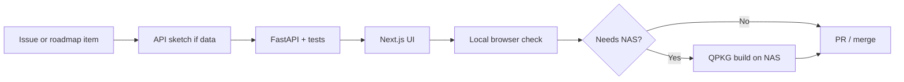

# Process

How we work from idea to a running host (standalone or QPKG). Architecture is in [architecture.md](architecture.md); open items are in [roadmap.md](roadmap.md) (being rebuilt). Storage rules: [storage.md](storage.md).

## Principles

1. **API first.** If the web UI needs data, define or extend OpenAPI, then implement FastAPI, then the UI.
2. **PC first, QNAP when needed.** Prove a feature on standalone Windows (Python + Next), then package for QNAP. Linux standalone uses the same Python.
3. **Docs follow decisions.** If we change stack or product scope, update `doc/` in the same change. Session start/end for agents: [index.md](index.md) **For AI Agents**.
4. **One repo.** `src/` and `doc/` live together. Azure DevOps `origin` is the daily remote.
5. **No Node as product runtime.** Next.js is a build-time tool. Do not add a Node service “just for convenience” on QNAP, Windows, or Linux.
6. **No extra database server.** Photo metadata and albums live in **SQLite** inside the Python app. Do not add MongoDB/PostgreSQL “for flexibility.”
7. **Storage only through FileStore/BlobStore.** Do not `open()` library files in scan, Takeout, media, or thumb code. FileStore reference: [filestore.md](filestore.md).
8. **No personal lab details in the tree.** Docs, tests, and UI examples use fictional `fileserver` / `nasuser`. Do not commit NAS hostnames, personal usernames, emails, session secrets, or real library counts.

## Roles of folders

| Path | Owner | Change when |
| --- | --- | --- |
| `doc/` | Product and architecture | Scope, process, or roadmap changes |
| `src/server/` | Python API, indexer, **storage module** | Backend behavior |
| `src/web/` | Next.js | UI only; must keep using `/api/v1` |
| `src/qpkg/` | Install/start/stop | QNAP packaging, ports, QTS integration |

## Development loop

### Daily local work

1. Run FastAPI (reload).
2. Run Next.js dev server with `/api` proxied.
3. Exercise the flow in the browser (list, empty, error—not only the happy path), or the same `/api/v1` calls in Postman (`postman/`).
4. Keep web types aligned with OpenAPI by hand. Do not generate a client.

### Before calling a feature done

- Works against the API (not mocked-only).
- Empty library and failed scan/auth are visible in the UI.
- No new Next server-only feature that static export cannot build.

## Git and review

- Branch from `main` for work; merge via PR when the team uses PRs.
- Commit when asked or at a coherent checkpoint; do not commit secrets (`.env`, NAS passwords, certificates).
- Prefer small PRs: API slice, then UI slice, rather than a giant QPKG dump.

Suggested commit focus: **why** (e.g. “add cursor pagination so the timeline can scroll”).

## Versioning

- **API:** URL prefix `/api/v1`. Breaking changes add `v2` or a compatibility window; do not silently break mobile later.
- **QPKG:** version in `qpkg.cfg` matches a release tag when we start shipping packages.
- **Web:** the exported assets are always built from the same git revision as the server they ship with.

## Testing

| Layer | v1 expectation |
| --- | --- |
| Python | pytest for API, **storage module**, and indexer (virtual paths, jail, EXIF fallbacks, pagination) |
| Web | Manual browser pass on changed flows; add component tests when UI stabilizes |
| API (manual) | Postman: import `postman/mosaicwave.postman_collection.json` |
| QPKG | Install, start, stop, restart on at least one QTS/QuTS box; web UI loads; API health |
| Standalone | Same API/UI checks on Windows (and later Linux) with a local data dir |

We do not treat “it compiled” as host verification.

## QPKG release process (Phase 6)

1. `scripts/publish.cmd qpkg` (or `publish-qpkg`): `next build`, copy export + `mosaicwave/` into `dist/qpkg/mosaicWave/`.
2. Once: `.\scripts\get-qdk.cmd` → `tools\qdk_*.deb`, then `apt-get install` that file in **WSL** ([qpkg.md](qpkg.md)).
3. `scripts/pack.cmd qpkg` (or `pack-qpkg`): runs `qbuild` (via WSL on this PC) for **x86_64 and arm_64**. Pass an arch to pack only that platform. Or pack on the NAS after installing the QDK QPKG.
4. Sideload the `.qpkg` that matches the NAS CPU in App Center; confirm start/stop/reboot and a scan of a sample share.
5. Only then consider App Center / internal distribution.

Python 3.12+ is a documented NAS dependency (venv on first start), not a bundled interpreter in v1. Intel and ARM QPKGs share the same payload; pip wheels are per-CPU on the NAS. Without ARM QTS hardware: Docker `--platform linux/arm64` can pytest wheels only ([qpkg.md](qpkg.md)); it is not an App Center test.

## Windows MSI (standalone)

Same Python app as `MOSAICWAVE_WEB_ROOT` one-process serve. Staging and pack live next to the QPKG scripts.

1. `scripts/publish.cmd msi` (or `publish-msi`): `next build`, copy export + `mosaicwave/` + service scripts into `dist/msi/mosaicWave/`.
2. Once: `.\scripts\get-winsw.cmd` → `tools\WinSW-x64.exe`; `dotnet tool install --global wix`. WiX 7: `wix eula accept wix7` (or rely on `pack-msi` `--acceptEula`).
3. `scripts/pack.cmd msi` (or `pack-msi`): WiX → `dist/msi/mosaicWave_0.1.0_x64.msi`.
4. Administrator: `.\scripts\install-msi.cmd` (optional port argument). Full UI: Web / API port and Windows service (first page). Start Menu + desktop shortcuts open `http://127.0.0.1:<port>/`. Confirm **Create admin**.
5. Uninstall does **not** delete `%PROGRAMDATA%\mosaicWave`.

Python 3.10+ on the target PC is a documented dependency (venv on first service start), not bundled in the MSI v1.

## Linux / macOS tarball (standalone)

Same app as MSI. Staging and pack:

1. `scripts/publish.cmd posix` (or `publish-posix`): `npm install` if needed, `next build`, copy export + `mosaicwave/` + `src/posix` scripts into `dist/posix/mosaicWave/`. Node.js is a build-host dependency, not on the install target.
2. `scripts/pack.cmd posix` (or `pack-posix`): `tar` → `dist/posix/mosaicWave_0.1.0_posix.tar.gz`.
3. On the target: `tar xf … && cd mosaicWave && sh install.sh` (macOS: `sudo sh install.sh`) then `mosaicWave start` if the service is not installed (Python 3.10+ on PATH). Optional `--systemd` / `--no-launchd`.
4. Uninstall does **not** delete `~/.local/share/mosaicWave` (Linux packaged), `~/.local/share/mosaicWave-dev` (Linux debug), `/Library/Application Support/mosaicWave` (macOS packaged), or `/Library/Application Support/mosaicWave-dev` (macOS debug).

## Tooling notes (this project)

- Develop on **Windows** (a supported standalone host). `publish-qpkg` stages the tree; `pack-qpkg` runs `qbuild` via WSL. Once: `scripts\get-qdk.cmd` → `tools\`, then **WSL** `apt-get install` ([qpkg.md](qpkg.md)).
- Azure DevOps is `origin`. Do not require Cursor Origin for daily push.
- TLS/proxy settings are environment-specific; document ports per host when packaging exists.

## Decision log (lightweight)

When we reverse a decision in these docs, add a one-line note here.

| Date | Decision |
| --- | --- |
| 2026-08-28 | Native QPKG; Python FastAPI; Next.js static export; one API for web and mobile |
| 2026-08-28 | Full Next.js SSR / Node on NAS rejected for the product runtime |
| 2026-08-28 | Google Photos API full-library sync is not a feature; Takeout is later |
| 2026-08-28 | SQLite for photo index and albums; MongoDB rejected for native QPKG |
| 2026-08-28 | Agent onboarding via `doc/index.md` + always-on `mosaicwave-status.mdc`; wrap-up is `mosaic done` |
| 2026-09-02 | Phase complete only on **`phase N done`**. `mosaic done` / `unity done` is wrap-up, not a phase gate |
| 2026-09-02 | Phase 3 is job workflow/audit (`workflow.md`). Gallery is Phase 4. Sync HTTP is Phase 7 |
| 2026-08-29 | NAS identity is QNAP accounts; FastAPI checks QTS/QNAP then issues `/api/v1` session |
| 2026-08-29 | Google Takeout import is Phase 2 (sample SQLite); not deferred to Phase 7 |
| 2026-08-29 | Schema + offline replica designed now (`schema.md`); sync HTTP in Phase 6 |
| 2026-08-31 | Multi-platform: QPKG is one packaging target. FileStore + BlobStore required (`storage.md`). Auth is QNAP on QTS, local users on standalone |
| 2026-08-31 | Authorization was `user` + `source_grant` (not all-users-all-sources). Takeout import: one asset per content hash; idempotent re-import |
| 2026-09-09 | Each user has one private library (`source.owner_user_id`). No admin bypass. **Share** is owner `source_grant` (`read`/`write`) |
| 2026-09-09 | Windows FileStore + BlobStore (and SQLite) default to `%PROGRAMDATA%\mosaicWave`, not `%LOCALAPPDATA%` |
| 2026-09-09 | Admin Settings can move the data folder; bootstrap `config.json` holds the path. `MOSAICWAVE_DATA_DIR` wins (QPKG sets it) |
| 2026-09-12 | Windows debug library is `%PROGRAMDATA%\mosaicWave-dev`; MSI production is `%PROGRAMDATA%\mosaicWave` |
| 2026-09-16 | macOS packaged install is `/Applications/mosaicWave.app` + `/Library/Application Support/mosaicWave` (ProgramData analogue). Linux stays per-user. |
| 2026-09-08 | Manual API tests via Postman collection (`postman/`). No generated OpenAPI client |
| 2026-09-17 | Public tree uses fictional SMB examples (`fileserver` / `nasuser`). No lab hostnames, personal names, emails, or real library stats |

## What “process” is not

- We do not require Docker to develop the API and UI.
- We do not block UI work on a finished QPKG if the API runs locally.
- We do not implement exploits, scanners, or NAS bypasses as “features.”
