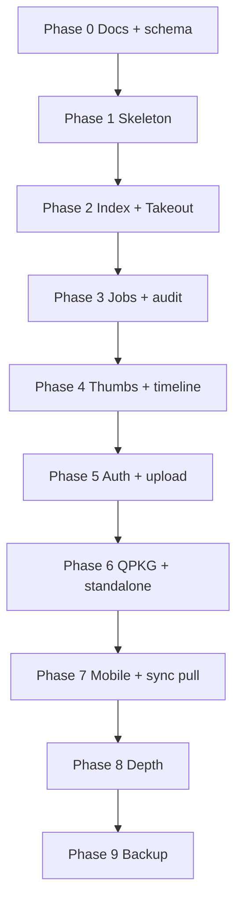

# Roadmap (archived)

> **Historical.** This is the Phase 0–9 plan as it stood on 2026-10-07, kept for reference. The live roadmap is [roadmap.md](roadmap.md) and is being rebuilt.

Phased delivery. Dates are not committed; **phases are sequential**. A phase can start when the previous phase’s exit criteria are met.

See [system overview](system-overview.md) for product scope and [architecture](architecture.md) for the stack.

## North star

A user installs mosaicWave (QPKG or standalone), selects a photo folder, and browses a **thumbnail timeline** in the browser. A phone can later use the **same API** to list and upload.

## Phase 0 — Foundation (done)

**Goal:** Shared understanding; empty code is OK.

- These documents under `doc/`
- Repo layout agreed (`doc/`, `src/server`, `src/web`, `src/qpkg`)
- Stack locked: FastAPI + Next static export + QPKG shell + **FileStore/BlobStore**

**Exit:** Team treats `doc/` as the default answer to “what are we building?” Agent onboarding: [index.md](index.md) **For AI Agents**, [status.md](status.md).

### Schema design (now — before Phase 2 code)

**Goal:** Lock NAS tables, UUIDs, and sync fields so Takeout and later offline clients share one model. See [schema.md](schema.md).

- Canonical SQLite on the server; originals stay in FileStore; thumbs in BlobStore
- Replica on web/mobile for offline metadata + thumbs
- `rev` / `updated_at` / `deleted_at` on every syncable row
- Sync HTTP in Phase 7; columns exist from Phase 2 DDL

**Exit:** [schema.md](schema.md) reviewed; Phase 2 implements it, does not invent a parallel schema.

## Phase 1 — Local skeleton

**Goal:** Two processes on a developer PC; hello-world API + empty UI.

- FastAPI: `/api/v1/health`, OpenAPI at `/docs`
- **Storage module:** FileStore + BlobStore protocols, local backends, pytest fakes ([storage.md](storage.md))
- Next.js app with `output: 'export'` verified (`next build` succeeds)
- Dev rewrite: browser `/api` → uvicorn
- Placeholder home page that calls health and shows OK/fail

**Exit:** Clone, run server, run web, see health in the UI. Storage unit tests pass. No QNAP required.

## Phase 2 — Library core + Takeout sample DB (local)

**Goal:** Index files on disk **and** import an extracted **Google Takeout** tree so SQLite is a usable sample (dates, GPS extras, albums). See [takeout.md](takeout.md).

- Configure one content source (path in config or env → LocalFileStore)
- Scan: image/video extensions, skip junk and `*.json` — **via FileStore only**
- SQLite `asset` / `album` rows per [schema.md](schema.md) (UUIDs, `rev`, tombstones)
- **Takeout:** sidecar JSON → `taken_at` / `extra_json`; album folders → `album` / `album_asset`; **SHA-256 dedup** so date-folder + album copies are one asset; re-import is idempotent
- `POST /api/v1/import/takeout` (path to extracted dump)
- `GET /api/v1/assets` with cursor pagination
- Web: simple list (filename + date), empty and error states
- Sample data: local extract or tiny test fixture **with a duplicate pair** — **not** git personal Takeout archives
- DDL includes `user` / `source_grant` (enforced in Phase 5)

**Exit:** Import a small Takeout extract (or fixture); **one** asset for a photo copied into an album folder; second import does not add rows; list API returns them.

## Phase 3 — Job workflow + audit

**Goal:** Durable **task runs** in SQLite so Takeout import (and later scan / thumbs) can be listed for audit after restart. See [workflow.md](workflow.md).

- `job` table (kind, status, times, input/result JSON, progress). Optional `job_event` log
- Takeout import writes a job instead of process-memory only
- `GET /api/v1/jobs` and `GET /api/v1/jobs/{id}` (**admin**)
- Web: simple jobs list; import progress bound to a job id
- One job at a time in-process. Not Temporal / BPMN

**Exit:** Restart the API; the last Takeout import still appears in `GET /api/v1/jobs` with status and counts.

## Phase 4 — Gallery UX (done)

**Goal:** Feels like a gallery, still local.

- Thumbnails generated by Python into BlobStore; `GET .../thumb`
- Timeline grouping by day/month (API or UI)
- Detail view: large preview + download original
- Basic EXIF `taken_at` (fallback mtime)
- Static export still builds; thumbs via API URLs
- Thumb batches run as jobs ([workflow.md](workflow.md))

**Exit:** Scroll a grid, open a photo, see a sensible date order.

## Phase 5 — Auth and uploads (done)

**Goal:** Not an open filesystem API.

- Login via **auth provider**: QNAP users on QTS (QTS session + `POST /api/v1/auth/login` checks QNAP); **local hashed users** on standalone. Stub only in earlier phases.
- **Authorization:** `user` + `source_grant`; admin vs member; list/file/sync filtered. Not all-users-all-sources
- All library routes authenticated
- Upload into a source via FileStore requires **write** grant; file appears in Explorer/File Station *and* after scan/index when backend is local
- Settings UI: add/remove source and **grants** (admin)

**Exit:** Logged-out users cannot list assets; a member without a grant cannot see that source; upload then visible in timeline for users with write.

## Phase 6 — Host packaging (QPKG + standalone)

**Goal:** Same app runs as a QNAP package **and** as a documented standalone install.

- QDK layout, start/stop, data directory, port; `platform=qnap`
- Bundle Python (or documented QPKG dependency)
- Pack exported web into the package
- Content sources = NAS shared folders (picker or documented path) via LocalFileStore
- Install/start/stop/restart test on one NAS (x86_64 first)
- Standalone: data dir, bind, `platform=standalone` documented (Windows proven from Phase 1)

**Exit:** Sideloaded QPKG serves UI and API; scan a share; gallery works after reboot. Standalone run instructions match the same API.

## Phase 7 — Mobile-ready API + sync

**Goal:** Same `/api/v1` usable by web and a later client, including metadata pull for an offline replica. The OpenAPI document is **generated from FastAPI and will keep changing** until product freeze (not this phase).

- OpenAPI published for list, detail, thumb, file, upload, auth, sync (`/docs`, `/openapi.json`) — living spec
- Pagination and error shape stable enough to iterate
- `GET /api/v1/sync/changes` (or equivalent) per [schema.md](schema.md)
- HTTPS notes (QNAP certificate / reverse proxy, or standalone Caddy/nginx)—document only
- API tests: Postman collection in `postman/` (not a generated client). Optional later: PWA; mobile uses the same `/api/v1`

**Exit:** A second client can log in, list, fetch a thumb, and **pull metadata changes** into a local store (pytest is enough).

## Phase 8 — Product depth (after usable gallery)

Order may shift; none of these are v1 blockers:

| Item | Notes |
| --- | --- |
| Virtual albums | Metadata in SQLite; files still in folders |
| Video playback | Skip on a time bar (play, pause, jump). Later optional transcode |
| People / AI | Optional; heavy RAM; after gallery is solid |
| ARM64 QPKG | Second architecture (`arm_64`, QTS 5+). Not TS-431 ARMv7 / QTS 4.3 |
| Linux / macOS deploy | Tarball + `install.sh` (`publish-posix`). Host unpack not user-tested |
| Share (`source_grant`) | User-tested: owner `PUT /sources/{id}/grants`; `read` / `write`; no admin bypass |
| Sharing links | Careful auth; easy to get wrong |
| Sync Postman (create-id, membership, tombstone) | Collection folder **Sync replica**; run after Login + List assets |

**Exit:** Gallery depth that shipped in this phase (albums, share, MSI, video, Takeout push). Linux/macOS packaged install and ARM64 QPKG sideload may still be open.

## Phase 9 — Backup / restore / export

**Goal:** A product way to archive and restore the library, and to export selected photos as ordinary files. Sync JSON is **never** a backup.

- **Backup:** archive of the data dir (`library.db` + FileStore originals + BlobStore thumbs)
- **Restore:** restore that archive onto a host
- **Export:** selected albums/assets as ordinary files (not a replica dump)
- Until this ships, a host-level copy of the data folder (stop the API or use SQLite backup APIs) remains valid

**Exit:** User can back up, restore, and export without replaying sync JSON.

## Brainstorm (not scheduled)

Parking lot. **Not a phase.** Do not implement from this list unless an item is promoted into a numbered phase. mosaicWave stays a single-user/household app on the user’s host — not a multi-tenant cloud ([system-overview.md](system-overview.md)).

1. **User’s own cloud drive as a photo source** — Google Drive, Dropbox, OneDrive, iCloud **Drive**, S3-compatible, … through a FileStore backend. SQLite still holds only metadata. **Not scheduled.** Design notes: [filestore-later.md](filestore-later.md). Does **not** mean mosaicWave stores the library in *our* cloud. iCloud **Photos** is not FileStore-shaped.

## Intentionally later or never (this roadmap)

- Full Next.js Node runtime as the product (QNAP or standalone)
- Google Photos Library/Picker as a full-library sync
- Wrapping Immich as the product
- Matching QuMagie AI on the first release
- Using **sync JSON** as a library backup (**never**). Product backup/restore/export is **Phase 9** (data dir archive)
- Multi-device CRDT / posting a whole `sync/changes` blob back

## Dependency view

Phase 6 can overlap the end of Phase 5 if packaging starts while auth is finishing, but **do not** ship a QPKG or a LAN-bound standalone that exposes an unauthenticated library API.

## Next concrete step

**Phase 8 — Product depth:** album **push** Postman-tested. **Share** user-tested. Linux/macOS **tarball scripts** in. Open: unpack that tarball on a real Linux/macOS host; ARM64 QPKG on QTS 5. **Backup / restore / export** is Phase 9.
