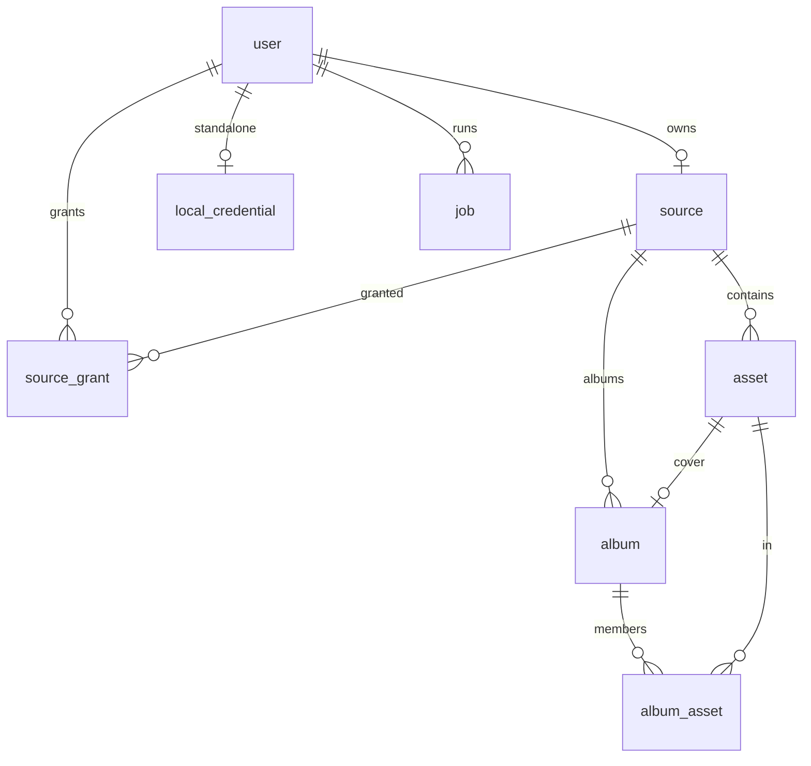

# Data schema (SQLite)

**Implemented in Phase 2.** This is the physical schema in `library.db`. Source of truth in code: `src/server/mosaicwave/models.py`. SQLAlchemy `create_all` on startup — no migration tool yet.

Client replica + sync HTTP remain **Phase 7**. Sync columns (`id`, `rev`, `updated_at`, `deleted_at`) are already on every syncable table so we do not migrate later.

Related: [filestore.md](filestore.md), [storage.md](storage.md), [takeout.md](takeout.md), [architecture.md](architecture.md).

## File location

| Host | Default path |
| --- | --- |
| Windows MSI | `%PROGRAMDATA%\mosaicWave\library.db` (typically `C:\ProgramData\mosaicWave`) |
| Windows debug | `%PROGRAMDATA%\mosaicWave-dev\library.db` (`scripts\start.cmd`) |
| Linux packaged | `~/.local/share/mosaicWave/library.db` (or `$XDG_DATA_HOME/mosaicWave`) |
| Linux debug | `~/.local/share/mosaicWave-dev/library.db` (`scripts/start.sh`) |
| macOS packaged | `/Library/Application Support/mosaicWave/library.db` |
| macOS debug | `/Library/Application Support/mosaicWave-dev/library.db` (`scripts/start.sh`) |
| Admin Settings | Path in `{bootstrap}/config.json` (`data_dir`, plus `data_dir_smb` / `data_dir_mount` when on a share). Photos/thumbs follow `{data_dir}`; SQLite stays at `{bootstrap}/library.db`. UNC / `smb://`: [smb-paths.md](smb-paths.md) |
| Override | `$MOSAICWAVE_DATA_DIR/library.db` when that env is set (QPKG). Wins over Settings. |
| QNAP | `{volume}/.mosaicWave/library.db` (example `/share/CACHEDEV1_DATA/.mosaicWave`; `MOSAICWAVE_DATA_DIR`; survives QPKG Remove) |

The API creates this file on first start (`create_all` in `db.py`). To create or migrate tables **without** uvicorn:

```
scripts\wipe.cmd
scripts\wipe.cmd --db
scripts\wipe.cmd --storage
sh scripts/wipe.sh
sh scripts/wipe.sh --db
sh scripts/wipe.sh --storage
```

No flags: wipes both — deletes `library.db` (and WAL) **and** `libraries/` (originals) **and** `blobs/` (thumbs), then recreates an empty schema. Pass one flag alone to wipe only that: `--db` (DB only) or `--storage` (originals + thumbs only). Neither touches `{data_dir}/tmp` (Takeout upload staging). There is no `--data-dir` override — this tool always targets the same folder the API itself uses (`Settings.from_env()`); to point it elsewhere, set `MOSAICWAVE_DATA_DIR` (the one override the API honors too). Stop the API first (`scripts\stop-api.cmd` / `sh scripts/stop-api.sh`). macOS debug `sh scripts/wipe.sh` re-execs with sudo (like `start.sh`) so an SMB-configured data dir can mount under `/Volumes`. Same Python: `cd src/server` then `python -m mosaicwave.wipe`. Does not create users (that is `POST /auth/setup`). Packaged installs have the same tool: `wipe.cmd` (MSI folder), `wipe.sh` or `mosaicWave.sh wipe` (posix tarball / QPKG) — [qpkg.md](qpkg.md).

Open with [DB Browser for SQLite](https://sqlitebrowser.org/) or [DBeaver](https://dbeaver.io/). Stop the API before **writing** rows, or work on a copy — SQLite is one-writer; editing while uvicorn runs can lock or corrupt.

`PRAGMA foreign_keys=ON` is set on every connection (`db.py`). Inspectors that open the file without that pragma will not enforce FKs.

Clients (web/mobile) **never** mount this file. They will use a replica over HTTP in Phase 7.

## What is stored where

| Kind | Where | Offline on client |
| --- | --- | --- |
| Original photo/video | FileStore (v1: local folder / QNAP share; not a DB blob) | Optional **pin/download**; not the whole library by default |
| Metadata (date, album, size, mime, GPS extras) | Server SQLite `asset` / `album` | **Yes** — replica of rows |
| Thumbnails | BlobStore (under the host data dir) | **Yes** — cache thumbs the user has seen or pinned |
| User/session | Auth provider identity; mosaicWave `user` row + session | Login required to sync; replica may stay readable until expiry policy |
| Who may see a source | Owner, plus live `source_grant` (`read` / `write`). No admin bypass | Sync payload is already filtered |

Do **not** put original JPEG/MP4 bytes into SQLite. That fights File Station/SMB/Explorer and blows up the database. “Store media data” means **metadata + pointers** (`relative_path`, size, hash), plus derived thumbs in the BlobStore. Host `root_uri` is never synced to clients. **Password hashes** stay on the server (`local_credential`); they are not replica entities. **Jobs** (`job` / `job_event`) are server audit only ([workflow.md](workflow.md)).

There is **no `folder` table**. Subdirectories exist only as segments of `asset.relative_path`. Unique identity on disk is `(source_id, relative_path)`.

## When we design vs implement

| When | What |
| --- | --- |
| **Phase 0 (this doc’s logical model)** | IDs, sync fields, conflict rules, what is not in the DB |
| **Phase 2 (done)** | Server SQLite from this doc; Takeout and folder scan fill it |
| **Phase 3** | `job` (+ optional `job_event`) — server audit, not synced ([workflow.md](workflow.md)) |
| **Phase 4** | Thumb files keyed by `asset.id`; `thumb_rev` already on `asset` |
| **Phase 7** | `GET /api/v1/sync/changes` pull; client local DB. Album push is Phase 8 (`base_rev`) |

## Identity and sync fields (every syncable row)

Public ids are **UUID strings** (API and clients). Do not use filesystem paths as primary keys (Takeout duplicates and renames).

On `asset`, `album`, `album_asset`, `source`, `user`, `source_grant`:

| Column | Role |
| --- | --- |
| `id` | UUID, stable across sync |
| `rev` | Library-wide change clock on syncable rows; insert/update sets `max(rev)+1` so `since_rev` pull sees new rows |
| `updated_at` | UTC timestamp |
| `deleted_at` | NULL or tombstone; sync **keeps** deleted rows until clients have seen them |

`content_hash` on `asset` is SHA-256 hex of file bytes (64 chars). **Required** for Takeout import — that is the Takeout dedupe key, not the public id. Enforced in `import_takeout` (lookup by hash), **not** a SQLite `UNIQUE` constraint yet. Folder scan also stores the hash but does **not** merge two paths with the same bytes.

## Tables



### `user`

| Column | Type | Notes |
| --- | --- | --- |
| `id` | TEXT PK | UUID |
| `provider` | TEXT | `qnap` \| `local` \| `stub` |
| `provider_subject` | TEXT | Identity from the auth provider |
| `display_name` | TEXT | |
| `role` | TEXT | `admin` \| `member` (default `member`) |
| `rev`, `updated_at`, `deleted_at` | | Sync fields |

Auth is enforced from Phase 5. DDL exists since Phase 2.

### `source`

One indexed tree. `root_uri` is the FileStore root on **this host**.

| Column | Type | Notes |
| --- | --- | --- |
| `id` | TEXT PK | UUID |
| `owner_user_id` | TEXT FK → `user.id` | One live library per user (`uq_source_owner_live`) |
| `backend` | TEXT | FileStore id. v1: `local` |
| `root_uri` | TEXT | `{data_dir}/libraries/{user_id}`. **Never** sent to web/mobile |
| `kind` | TEXT | `folder` (live FileStore root). Do not store a Takeout dump as a source; import copies into the owner's library. Legacy `takeout` rows (dump indexed in place) may still exist |
| `last_scan_at` | DATETIME | Last successful walk |
| `error` | TEXT | Last scan/import failure, or NULL |
| `rev`, `updated_at`, `deleted_at` | | Sync fields |

Created on first login / `/me` (`ensure_user_library`). Takeout dump path lives on the import **job** (`input_json`), not here.

### `source_grant`

| Column | Type | Notes |
| --- | --- | --- |
| `id` | TEXT PK | UUID |
| `user_id` | TEXT FK → `user.id` | |
| `source_id` | TEXT FK → `source.id` | |
| `perm` | TEXT | `read` \| `write` (default `read`) |
| `rev`, `updated_at`, `deleted_at` | | Sync fields |

Unique `(user_id, source_id)` — constraint `uq_grant_user_source`. **Owner** `GET`/`PUT /sources/{id}/grants` replaces the live list (tombstone removed rows). Access is owner **or** a live grant. No admin bypass. See [architecture.md](architecture.md) Authorization.

### `local_credential`

Standalone-only. Not a replica entity. Not used when `platform=qnap`.

| Column | Type | Notes |
| --- | --- | --- |
| `user_id` | TEXT PK, FK → `user.id` | |
| `password_hash` | TEXT | |

### `job`

Phase 3. Server audit of task runs. **Not** a replica entity.

| Column | Type | Notes |
| --- | --- | --- |
| `id` | TEXT PK | UUID |
| `kind` | TEXT | `takeout_import` (later `folder_scan`, `thumb_batch`) |
| `status` | TEXT | `queued` \| `running` \| `done` \| `error` \| `cancelled` |
| `created_at`, `started_at`, `finished_at` | DATETIME | UTC |
| `user_id` | TEXT FK → `user.id` | Owner of the job; list/status filter to this user |
| `input_json` | TEXT | Path and options |
| `result_json` | TEXT | Counts, `source_id`, warnings |
| `error` | TEXT | Last error |
| `processed`, `total` | INTEGER | Progress |
| `current` | TEXT | Virtual path being hashed |

A row with `status=running` at process start is marked `error` (`interrupted (process stopped)`).

### `job_event`

Append-only audit lines for one job.

| Column | Type | Notes |
| --- | --- | --- |
| `id` | TEXT PK | UUID |
| `job_id` | TEXT FK → `job.id` | Indexed |
| `at` | DATETIME | UTC |
| `level` | TEXT | `info` \| `error` |
| `message` | TEXT | Short line |

API: [workflow.md](workflow.md).

### `asset`

One row per indexed media file (folder scan) or per unique hash (Takeout).

| Column | Type | Notes |
| --- | --- | --- |
| `id` | TEXT PK | UUID — public id |
| `source_id` | TEXT FK → `source.id` | |
| `relative_path` | TEXT | Virtual `/` path inside the FileStore. See [filestore.md](filestore.md) |
| `size` | INTEGER | Bytes |
| `mtime` | FLOAT | POSIX mtime from FileStore `stat` |
| `mime` | TEXT | Guessed from extension |
| `width`, `height` | INTEGER | Pixel size from thumb generation (Phase 4) |
| `taken_at` | DATETIME | Sidecar → EXIF → file mtime |
| `duration` | FLOAT | Video; unused until later |
| `extra_json` | TEXT | Takeout GPS/caption and odd EXIF until promoted |
| `content_hash` | TEXT | SHA-256 hex; NULL allowed |
| `thumb_rev` | INTEGER | Bump when thumb file regenerated (Phase 4) |
| `rev`, `updated_at`, `deleted_at` | | Tombstone if the file disappears on rescan |

Unique `(source_id, relative_path)` — `uq_asset_source_path`.

Folder scan: two copies of the same bytes in `a/` and `b/` → **two** assets. Takeout: same SHA-256 → **one** asset; `relative_path` prefers a `Photos from YYYY` path when present.

A large pile of photos in **one directory** is many `asset` rows sharing a path prefix (`IMG_0001.jpg`, …). No extra folder rows, no automatic album (except Takeout non-date parent folders).

### `album`

Metadata only — not a directory. Takeout import creates rows from album folders. **Manual albums** use the same tables (`POST /api/v1/albums`); files are not moved. Deleting an album tombstones it; creating the same name again revives that row (SQLite unique `(source_id, name)` includes tombstones).

| Column | Type | Notes |
| --- | --- | --- |
| `id` | TEXT PK | UUID |
| `source_id` | TEXT FK → `source.id` | Owner's library; unique with `name` (`uq_album_source_name`) |
| `name` | TEXT | Takeout: immediate parent folder name |
| `cover_asset_id` | TEXT FK → `asset.id` | First member if unset |
| `sort` | INTEGER | Default 0 |
| `rev`, `updated_at`, `deleted_at` | | Sync fields |

Unique `(source_id, name)` among live rows so two users can both have “Trip to Kyoto”.

### `album_asset`

| Column | Type | Notes |
| --- | --- | --- |
| `id` | TEXT PK | UUID |
| `album_id` | TEXT FK → `album.id` | |
| `asset_id` | TEXT FK → `asset.id` | |
| `position` | INTEGER | Default 0 |
| `rev`, `updated_at`, `deleted_at` | | Sync fields |

Unique `(album_id, asset_id)` — `uq_album_asset`.

## Indexes

Today: primary keys plus the unique constraints above. `GET /api/v1/assets` orders by `taken_at DESC, id DESC` with a cursor; a dedicated index on `(taken_at, id)` is not created yet. Tens/hundreds of thousands of rows is the NAS/PC target; add indexes when list/sync is measured slow.

## Browse the live DB

Useful checks (skip tombstones with `deleted_at IS NULL`):

```sql
SELECT kind, root_uri, last_scan_at, error FROM source;

SELECT COUNT(*) FROM asset WHERE deleted_at IS NULL;

SELECT filename, taken_at FROM (
  SELECT relative_path AS filename, taken_at
  FROM asset
  WHERE deleted_at IS NULL
  ORDER BY taken_at DESC
  LIMIT 50
);

SELECT a.name, COUNT(*) AS n
FROM album a
JOIN album_asset m ON m.album_id = a.id AND m.deleted_at IS NULL
WHERE a.deleted_at IS NULL
GROUP BY a.id;
```

API list is a **timeline** (default 50, max 200), not a folder listing. The web UI currently loads the first page only.

## Client replica (web + mobile)

Same **entity names and ids**. Omit `root_uri` / `backend` / other users’ grants / credentials. Keep `relative_path` only if the UI shows folders. Sync **only** assets (and albums those assets belong to) in sources the user may read.

| Client | Local store |
| --- | --- |
| Mobile | SQLite (or equivalent) on device |
| Web | IndexedDB (metadata + thumb blobs); optional later SQLite-WASM |

Replica is a **cache**. If it disagrees with the server after sync, **the server wins** for file identity and bytes. Album edits from a replica use `base_rev`; stale JSON is **409**, not a silent overwrite. Live web UI may omit `base_rev` (last write wins). See **Sync protocol** below.

Offline UI may:

- Show timeline/albums from replica
- Show cached thumbs
- Queue **uploads** and album edits to push when online

Offline UI must not pretend a missing original is on disk; show “not downloaded”.

## Sync protocol (Phase 7 pull; Phase 8 album push)

This is **replica sync**, not a backup. Pull/push copy **metadata** (ids, names, membership, `rev`, tombstones). Originals stay in FileStore. Do not replay sync JSON to restore a library.

**Product backup / restore / export** is **Phase 9** ([roadmap.md](roadmap.md), [progress-todo.md](progress-todo.md)): an archive of the data dir (`library.db` + FileStore originals + BlobStore thumbs), plus restore of that archive, plus export (selected albums/assets as ordinary files). Stop the API or use SQLite backup APIs before copying the DB. Host-level copies of the data folder remain valid.

### `rev` handling

- Library-wide integer clock on `asset` / `album` / `album_asset`. Insert, update, and **delete** all set `rev = max(rev)+1`.
- **Pull:** `GET /api/v1/sync/changes?since_rev=&cursor=&limit=`. `since_rev` is exclusive (default `0`). Response `assets`, `albums`, `album_assets` (including rows with `deleted_at` set), `server_rev`, `next_cursor`. Client upserts by `id`. If `deleted_at` is set, hide/remove locally. `cursor` continues a truncated page (`rev|kind|id`). `limit` default 200, max 500.
- **Delete does not DROP the row.** Tombstone + new `rev` so other replicas still see the change. Gallery list APIs omit tombstones; only sync returns them.
- **Push albums:** there is no `POST /sync/changes`. Use `/api/v1/albums`. Send `base_rev` equal to the album’s `rev` from the last pull. **409** if the server `rev` differs (outdated JSON) — pull and retry. Omit `base_rev` only for the live web UI (last write wins).
- Uploads: `POST /api/v1/assets` (bytes in FileStore), then pull the new row. Errors: FastAPI `{ "detail": "…" }` (400 invalid cursor, 401 no session, 409 stale or name clash).

### v1 covered (API in; simple Postman done)

User-tested: pull → PATCH album `{ name, base_rev }` → 200 and a higher `rev`. 409 on a stale `base_rev` is the outdated-JSON case.

Also implemented (pytest; not required in that smoke test): `POST /albums` with a client `id`; membership add/remove with `base_rev`; `DELETE` album/`album_asset` with `?base_rev=`; pull of tombstones.

### Not covered in v1 — when we enhance

| Gap | When |
| --- | --- |
| Postman recipes for create-`id`, membership `base_rev`, delete + tombstone pull | Folder **Sync replica** in `postman/` (run 1–6 after Login + List assets) |
| Push a whole pull JSON blob / `POST /sync/changes` | **Not planned.** Shape stays per-album routes |
| Asset metadata-only push (rename/caption without a file) | After **share**, if a client needs it. Today: upload file or rescan |
| `DELETE /assets` (tombstone from API, not only rescan) | After **share** or with a recycle-bin UI — not a backup restore |
| Two-device merge / CRDT | **Not v1.** 409 + pull; no automatic merge |
| Treat sync JSON as a library backup | **Never.** Use **backup / restore / export** (Phase 9): data dir archive, not this protocol |

Auth: same mosaicWave session as the rest of `/api/v1`. No anonymous sync. Do not use Google Photos APIs as a sync engine.

## Conflict and scope (v1)

- **Originals:** server FileStore wins. Client cannot “overwrite” a server file via metadata sync.
- **Metadata/albums:** higher `rev` wins; push with stale `base_rev` fails.
- **No multi-device CRDT** in v1. Replica push with a stale `base_rev` is **409** (pull and retry). Live web UI without `base_rev` is last-write-wins.
- Sync the **sources the caller may read** (own library plus grants), not the whole disk. After a grant is revoked, do a full pull (`since_rev=0`) or drop local rows that are no longer listed.

## Out of schema

- Face embeddings
- Original media blobs in SQLite
- A `folder` table (paths live on `asset.relative_path`)
- Password hashes or other users’ grants in the client replica
- Per-client schema that does not map 1:1 to these ids
- Mongo or a second server database for “flex sync”
