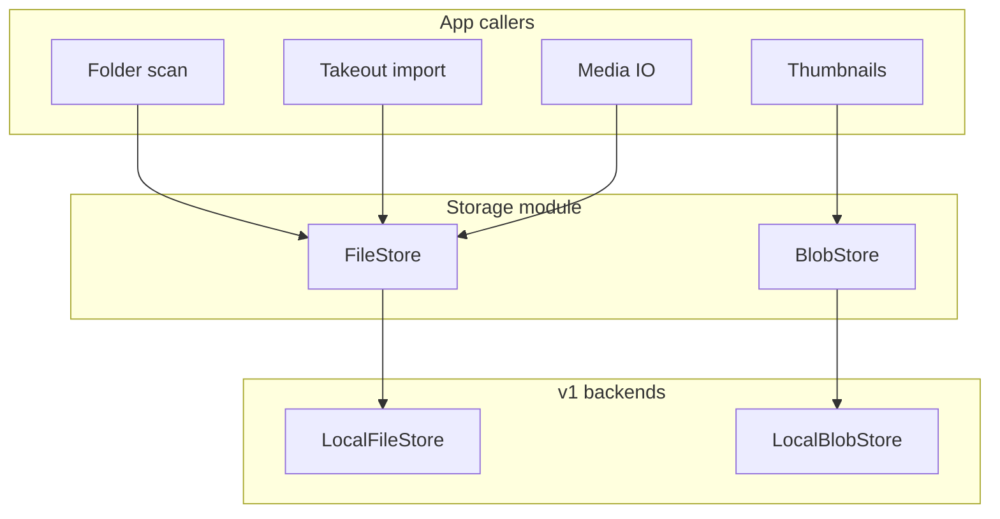

# Virtual file and blob storage

**Decision (2026-08-31):** mosaicWave is a **multi-platform** Python app. QNAP QPKG is a first-class **packaging** target, not the only runtime. All original-media and derived-byte I/O goes through a small **storage module** (`FileStore` + `BlobStore`) so Windows, Linux, and QNAP share one code path.

Related: [filestore.md](filestore.md) (implemented FileStore), [smb-paths.md](smb-paths.md) (UNC / `smb://`), [architecture.md](architecture.md), [schema.md](schema.md), [roadmap.md](roadmap.md).

## Why

The indexer, Takeout import, media download/upload, and thumbnail cache must not call `open()` / `os.path` on host paths except **inside** storage backends. QNAP shared folders are just local directories on the NAS; a local-filesystem backend covers QNAP, Windows, and Linux. Object storage (S3-style) can be a later backend without rewriting callers.

## How to read the S-numbers

**S1–S15** are requirement IDs in this file, not Amazon products. **S3** in the table below means “local filesystem backends.” **Amazon S3** (Simple Storage Service) is a different thing — object storage on the internet; that is **S15** (later). Background: [filestore-later.md](filestore-later.md) § Background.

Everything below is **in scope for the design**. v1 **implements** the local backends and the items marked **v1**. The rest must not be designed out (callers stay backend-agnostic) but are not coded until a later phase.

### A. Storage module (required now)

| # | Requirement | v1 |
| --- | --- | --- |
| S1 | **`FileStore`** protocol for originals: hierarchical virtual paths, list/walk, stat, streaming read, write, delete, exists | Yes |
| S2 | **`BlobStore`** protocol for derived bytes (thumbs, later previews/transcodes): get/put/delete/exists/stat by opaque key | Yes |
| S3 | **Local filesystem** backends for both (`LocalFileStore`, `LocalBlobStore`). QNAP shares, Windows folders, and Linux paths use this backend. **Not** Amazon S3 | Yes |
| S4 | Application layers (scan, Takeout, Media IO, thumbs) **only** talk to these protocols — never `pathlib`/`open` on library files | Yes |
| S5 | Virtual **`relative_path`** in SQLite: `/` separators, no drive letters, no `..`, not a primary key | Yes |
| S6 | `source` rows name a **backend id** + **root URI/path** (see [Schema](#schema)); clients never receive the host locator | Yes |
| S7 | Streaming reads and **HTTP Range** (seek or ranged get) for originals and, if useful, large blobs | Yes |
| S8 | **Atomic put** on local backends (write temp + replace) so a crash does not leave a truncated original or thumb | Yes |
| S9 | **Jail:** no path traversal, no following symlinks/junctions out of the source root | Yes |
| S10 | Stable errors: `NotFound`, `PermissionDenied`, `NotSupported`, `InvalidPath` — scan records these on `source.error` / asset skip | Yes |
| S11 | Blob **key namespace** convention (`thumb/{asset_id}/{thumb_rev}`, `preview/{asset_id}/{thumb_rev}`) — keys are not user-supplied URL paths | Yes |
| S12 | **Fake / temp-dir** stores for pytest (no NAS, no real photo tree required) | Yes |
| S13 | Interface must **not assume POSIX** (Windows drive letters, UNC, case-insensitive lookup, `MAX_PATH` / long-path) | Yes |
| S14 | Bounded thumb cache is a **policy on BlobStore** (delete by prefix/key), not a hardcoded QPKG folder layout in callers | Yes |
| S15 | Later **object-storage / cloud-drive FileStore** (Amazon S3 or compatible, Drive, OneDrive, …) addable without changing API or SQLite entity ids. Not in v1. [filestore-later.md](filestore-later.md) | Later |

### B. Multi-platform host (required because storage is not QNAP-only)

| # | Requirement | v1 |
| --- | --- | --- |
| P1 | **Platform profile:** `qnap` \| `standalone` (Windows or Linux). Detectable from env/config, not from “we compiled a QPKG” | Yes |
| P2 | Portable **data directory** for SQLite + FileStore libraries + BlobStore: QNAP `{volume}/.mosaicWave` (survives App Center Remove); Windows **MSI** `%PROGRAMDATA%\mosaicWave`; Windows **debug** `%PROGRAMDATA%\mosaicWave-dev`; Linux packaged `~/.local/share/mosaicWave`; Linux debug `~/.local/share/mosaicWave-dev`; macOS **packaged** `/Library/Application Support/mosaicWave`; macOS **debug** `/Library/Application Support/mosaicWave-dev`. Override: `MOSAICWAVE_DATA_DIR` (wins), else admin Settings (`config.json` next to the platform default) | Yes |
| P3 | **Config + env** (`MOSAICWAVE_DATA_DIR`, bind host/port, platform, storage backends). Admin **Settings** can change the data folder when env is unset. QPKG start sets `MOSAICWAVE_DATA_DIR`, so that UI is read-only on QNAP | Yes |
| P4 | **Auth provider** interface: QNAP accounts on QTS; **local hashed users** on standalone. Public contract stays `/api/v1/auth/*` | Phase 5 |
| P5 | **Authorization:** one private library per user (`source.owner_user_id`) plus owner `source_grant` (`read`/`write`). Admin does not see other libraries without a grant. | Enforced |
| P6 | **Packaging:** QPKG remains. Standalone = documented `uvicorn` / Python package **and** Windows MSI (`publish-msi` / `pack-msi`, service via WinSW) **and** Linux/macOS tarball (`publish-posix` / `pack-posix`, optional systemd user unit or launchd). Docker is optional, not the product | QPKG Phase 6; MSI + posix pack Phase 8; standalone docs with Phase 1 run |
| P7 | One **Python process** on every host (API + workers). No Node runtime for the product UI on QNAP, Windows, or Linux | Yes |
| P8 | **Scan** is portable: **polling / explicit scan** first. inotify / `ReadDirectoryChanges` are optional later, behind the same “scan this FileStore” API | Yes (poll/scan) |
| P9 | Unicode paths, Windows **reserved names** (`CON`, `NUL`, …), and permission errors must not crash the indexer | Yes |
| P10 | **First-run** on standalone: create data dir, empty SQLite, listen on a documented bind (localhost default until auth exists) | Phase 1–2 |
| P11 | Health is **process** health, not “QPKG only”. Same `/api/v1/health` on every host | Yes |
| P12 | Host filesystem paths **must not** appear in client API JSON (omit `root_uri`; folder UI uses virtual `relative_path`) | Yes |
| P13 | **Coexistence** with File Station / SMB / Explorer applies **only** when the FileStore is local-disk. An object-storage backend does not promise a side-channel file tree | Yes (document) |
| P14 | Tests for storage run on the **developer Windows** machine without a NAS | Yes |
| P15 | TLS/reverse-proxy notes are **per host** (QNAP myQNAPcloud / proxy; standalone behind Caddy/nginx or later). Not a QNAP-only paragraph | Phase 6–7 |

### C. Explicitly not required (do not build)

- FUSE / WinFsp virtual drives for the library
- Putting original JPEG/MP4 bytes in SQLite
- MongoDB or a second database server
- Encryption-at-rest inside the storage module (defer; OS/NAS disk encryption is the user’s)
- Multi-host shared blob store / distributed locks (single process is the runtime)
- Copying `/etc/shadow` or bypassing QNAP auth on a QPKG install

---

## Module shape

Python package: `mosaicwave.storage` (`src/server/mosaicwave/storage/`). FileStore details: [filestore.md](filestore.md).



| Protocol | Stores | Address | v1 backend |
| --- | --- | --- | --- |
| **FileStore** | Originals | `source` + `relative_path` | User folder / QNAP share (same files as Qfile) |
| **BlobStore** | Derived files only | Opaque key | Directory under data dir |

Originals stay **files on a folder backend** so SMB/Explorer/File Station still see them. Blobs are **not** the originals.

### FileStore (implemented)

Protocol, virtual paths, jail, `walk` vs `list`, and many-files-in-one-folder: **[filestore.md](filestore.md)**.

- `stat(rel) -> size, mtime, is_dir`
- `list(rel) ->` names (not recursive)
- `walk() ->` files the indexer should consider
- `open_read(rel) ->` binary stream (seekable when the backend can)
- `open_write(rel) ->` create/replace file under the source root
- `delete(rel)`, `exists(rel)`
- `resolve` is internal; it never returns a path to FastAPI route handlers for use in responses

`rel` is a virtual path: `/` separated, relative to the source root, no leading slash required (normalize to a single form in code).

### BlobStore (illustrative)

- `stat(key)`, `exists(key)`
- `get(key) ->` stream
- `put(key, stream)`
- `delete(key)`
- Optional later: `delete_prefix(prefix)` for cache eviction

Keys are ASCII (plus `/` as a namespace separator). Example: `thumb/{asset_uuid}/{thumb_rev}.jpg`.

### Local backends

**LocalFileStore** is rooted at `source.root_uri` (a filesystem path on that host). QNAP `/share/Photos`, `D:\Pictures`, and `/home/me/photos` are the same class.

**LocalBlobStore** is rooted at `{data_dir}/blobs/`.

Data dir layout:

```
{bootstrap}/              # Windows MSI %PROGRAMDATA%\mosaicWave; debug %PROGRAMDATA%\mosaicWave-dev; Linux ~/.local/share/mosaicWave (debug mosaicWave-dev); macOS packaged /Library/Application Support/mosaicWave; macOS debug /Library/Application Support/mosaicWave-dev
  config.json             # optional {"data_dir": "...", "data_dir_smb": "smb://host/share/folder", "data_dir_mount": "/Volumes/mosaicWave-host-share"} — stays here when the library moves
  session.key             # cookie HMAC; stays here so a failed NAS move does not invalidate login
  library.db              # SQLite metadata; stays here (not on SMB) unless MOSAICWAVE_DATA_DIR is set
  runtime/                # packaged venv; not moved when Settings changes {data_dir} (NAS chmod/symlinks)
{data_dir}/               # library folder — QNAP: {volume}/.mosaicWave (not under .qpkg); else same as bootstrap unless Settings/env moved it
  blobs/                  # BlobStore (thumbs, previews)
    thumb/
  libraries/              # FileStore originals (one folder per user)
    {user_id}/
  tmp/                    # Takeout uploads (`tmp/takeout-push/{job_id}`); Save folder does not copy this
```

Settings shows **App folder** (`{bootstrap}`), **Current library** (`{data_dir}`, read-only), and a **Move library** editor. Save folder moves photos and thumbnails only. SQLite stays in the App folder. Occupancy ignores `session.key` / `runtime` / `config.json` and leftover `library.db`. Returning the library to `{bootstrap}` replaces leftover `libraries/` / `blobs/` there. A foreign folder that already has photos or thumbs still 409s.

Windows MSI `{data_dir}` is `%PROGRAMDATA%\mosaicWave` (typically `C:\ProgramData\mosaicWave`). Local debug (`scripts\start.cmd`, or uvicorn from the repo) uses `%PROGRAMDATA%\mosaicWave-dev`. Linux packaged `{data_dir}` is `~/.local/share/mosaicWave`; Linux debug is `~/.local/share/mosaicWave-dev`. macOS packaged install is `/Library/Application Support/mosaicWave` (same role as ProgramData); local Mac debug is `/Library/Application Support/mosaicWave-dev`. The Mac app payload is `/Applications/mosaicWave.app`. On QNAP, `{data_dir}` is `{volume}/.mosaicWave` (not under `.qpkg/mosaicWave`, so Remove does not delete the library). Admin Settings can move `{data_dir}` on standalone only after Save folder: copy first, then write `config.json`, then remove the old files. A failed copy leaves the original folder and clears partial files from the new folder (so the destination looks empty). Path rewrite for `source.root_uri` is done on a local tempfile so SQLite is not opened on the destination during copy. Typed `smb://` and UNC: [smb-paths.md](smb-paths.md). The pointer remains in `{bootstrap}/config.json`. The packaged `runtime/` venv, `session.key`, and `library.db` stay at bootstrap (do not copy them onto a NAS share). Save folder does not copy `{data_dir}/tmp`. `MOSAICWAVE_DATA_DIR` wins over that file (QPKG start sets it) and then `library.db` lives in that folder so QPKG Remove does not wipe it.

---

## Schema

`source` gains a backend locator. **`relative_path` on `asset` is unchanged** (virtual path inside that store).

```
source
  id, backend, root_uri, kind (folder | takeout), last_scan_at, error,
  rev, updated_at, deleted_at
```

| Column | Role |
| --- | --- |
| `backend` | FileStore id. v1: `local`. Later: e.g. `s3` |
| `root_uri` | For `local`: host filesystem path. Never sent to web/mobile |
| `kind` | How we interpret the tree (`folder` vs Takeout layout) |

`root_path` in earlier drafts is this `root_uri`. Do not keep both.

Blob locations are **not** columns. Thumb bytes live in BlobStore; SQLite keeps `asset.thumb_rev` only.

Canonical table list: [schema.md](schema.md).

---

## Auth (consequence of standalone)

On **QPKG / QTS:** identity is still **QNAP accounts**. FastAPI does not keep a password table **on that profile**. A `user` row still stores role.

On **standalone:** there is no QTS. Phase 5 ships a **local auth provider** (hashed passwords in `local_credential`). That store is **profile-gated** — it is not used when `platform=qnap`.

**Authorization** is app-level on every profile: each user has one private library; others see it only via `source_grant`. Details: [architecture.md](architecture.md) Authentication and Authorization.

Phases 1–4 may keep a documented **stub admin** on every platform.

---

## Implementation order

| Phase | Storage work |
| --- | --- |
| **1** | Package + protocols + `LocalFileStore` / `LocalBlobStore` + pytest fakes. Health UI does not depend on photos yet |
| **2** | Scan and Takeout use **FileStore only** |
| **3** | Thumbs use **BlobStore only** |
| **4** | Upload uses FileStore `open_write`; auth providers as above |
| **5** | QPKG data dir + standalone data dir both feed the same module |
| Later | Optional object-storage backend; optional native file watchers |

---

## Testing

- Temp directory FileStore: walk, jail (`..`), write/read/delete, Unicode name
- Windows: reserved names skipped or recorded as errors, not a process crash
- BlobStore: put/get/delete, atomic replace, key with `/`
- Callers in unit tests receive fakes; no real Takeout dump required
